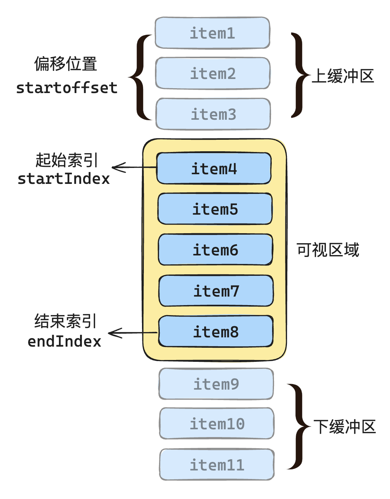
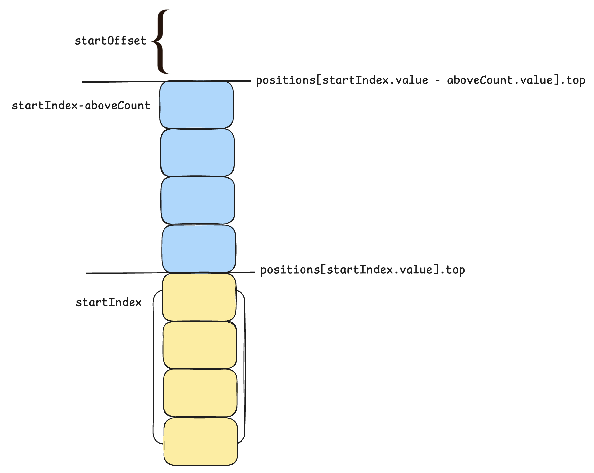
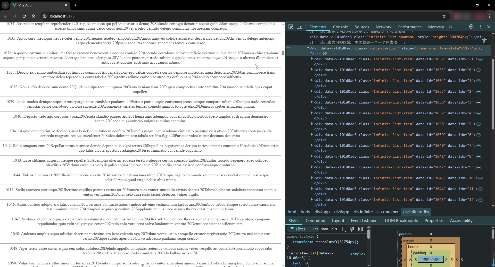

# P4S27L81：Vue3 应用场景之：虚拟列表优化——缓冲区与滚动优化

---


> [!tip]
>
> 手写虚拟列表遗留的问题：
>
> - 动态高度（`P4S26L80` 已解决）
> - 白屏问题（:star: 本节重点）
> - 滚动事件触发频率过高（:star: 本节重点）


## 1 白屏问题

在 `S26L80` 课虚拟列表的第一版实现中，如果滚动过快，屏幕会出现白屏和闪烁。这是因为先加载出来的是白屏（没有渲染内容），然后迅速会被替换为表格内容，从而出现闪烁。越低性能的浏览器上表现得越明显。

解决思路：

为了让页面的滚动更加平滑，我们可以在原先列表结构的基础上加上 **缓冲区**，也就是整个渲染区域由 **可视区 + 缓冲区** 共同组成，这样就给滚动回调和页面渲染留出了更多的时间。



这样设计后，缓冲区的数据会进入到可视区域，而我们要做的就是更新缓冲区中的数据。


## 2 上下缓存条数的计算

代码片段：

```js
const aboveCount = computed(() => {
  // 缓冲区列表项个数的计算，其实就是可视区显示个数 * 缓冲比例
  // 但是考虑到可能存在当前虚拟列表处于最顶端，所以需要和 startIndex 做一个比较，取最小值
  return Math.min(startIndex.value, props.bufferScale * visibleCount.value)
})

const belowCount = computed(() => {
  return Math.min(props.listData.length - endIndex.value, props.bufferScale * visibleCount.value)
})
```

例如，假设有如下场景：

- 总共有 `100` 项数据：`props.listData.length = 100`；
- 当前可视区域显示 10 项：`visibleCount.value = 10`；
- `bufferScale` 设置为 1：表示上下各缓存一条列表项；
- 当前 `startIndex.value = 20`：表示当前可视区域从第 `21` 项开始显示；
- 当前 `endIndex.value = 29`：表示当前可视区域显示到第 `30` 项。

计算 `aboveCount`：

```js
const aboveCount = Math.min(20, 1 * 10)
// 计算结果为 Math.min(20, 10) = 10
```

计算 `belowCount`：

```js
const belowCount = Math.min(100 - 30, 1 * 10)
// 计算结果为 Math.min(70, 10) = 10
```

因此最终上下的缓冲区的缓冲列表项目均为 `10`。


## 3 可见区域偏移量的计算

另外关于整个列表的渲染，之前是根据索引来计算的，现在就需要额外加入上下缓冲区大小重新计算，如下所示：

```js
const visibleData = computed(() => {
  let startIdx = startIndex.value - aboveCount.value
  let endIdx = endIndex.value + belowCount.value
  return props.listData.slice(startIdx, endIdx)
})
```

最后，因为多出了缓冲区域，所以偏移量也要根据缓冲区来重新进行计算，如下所示：

```js
const setStartOffset = () => {
  let startOffset

  // 检查当前可视区域的第一个可见项索引是否大于等于1（即当前显示的内容不在列表最开始的地方）
  if (startIndex.value >= 1) {
    
    // 计算当前可视区域第一项的顶部位置与考虑上方缓冲区后的有效偏移量
    // positions[startIndex.value].top 是当前可视区域第一项的顶端位置
    // positions[startIndex.value - aboveCount.value].top 是考虑上方缓冲区后，开始位置的顶端位置
    // 如果上方缓冲区存在，则减去它的顶端位置；否则使用 0 作为初始偏移量
    let size =
      positions[startIndex.value].top -
      (positions[startIndex.value - aboveCount.value]
        ? positions[startIndex.value - aboveCount.value].top
        : 0)

    // 计算 startOffset：用当前可视区域第一个项的前一项的底部位置，减去上面计算出的 size，
    // 这个 size 表示的是在考虑缓冲区后需要额外平移的偏移量
    startOffset = positions[startIndex.value - 1].bottom - size
  } else {
    // 如果当前的 startIndex 为 0，表示列表显示从最开始的地方开始，没有偏移量
    startOffset = 0
  }

  // 设置内容容器的 transform 属性，使整个内容平移 startOffset 像素，以确保正确的项对齐在视口中
  content.value.style.transform = `translate3d(0,${startOffset}px,0)`
}
```

至于这个 `startOffset` 具体是怎么计算的，如下图所示：



`setStartOffset` 方法重写完毕后，整个白屏闪烁问题也就完美解决了。


## 4 滚动事件触发频率过高

上一版实现中，我们绑定的是 `scroll` 滚动事件，虽然效果实现了，但是 `scroll` 事件的触发频率非常高，每次用户一滚动就会触发，而每次触发都会执行 `scroll` 回调方法。

解决思路：

使用 `IntersectionObserver` 来替换 `scroll` 事件的监听。这样就能仅在被观测元素出现在视口内才执行滚动回调逻辑，从而优化滚动性能。

相比 `scroll`，`IntersectionObserver` 可以设置 **多个阈值** 来检测元素进入视口的不同程度，只在必要时才进行计算，没有性能上的浪费。并且监听回调也是 **异步触发** 的。


## 5 实测备忘

:one: 实测时将源代码中的变量名重新命名，并清除了多余注释。重点掌握三次优化（添加缓冲区、`IntersectionObserver` 的引入、以及二分法查找第一项）的解决思路。

实测截图：



:two: 如果使用 `Tanstack` 重构本例，只需配置 `overscan` 参数即可（默认值为 `1`）：

```js
const virtualizer = useVirtualizer({
  count: sentences.value.length,
  getScrollElement: () => parentRef.value,
  estimateSize: () => props.estimatedItemSize,
  overscan: 1 // by default
})
```

