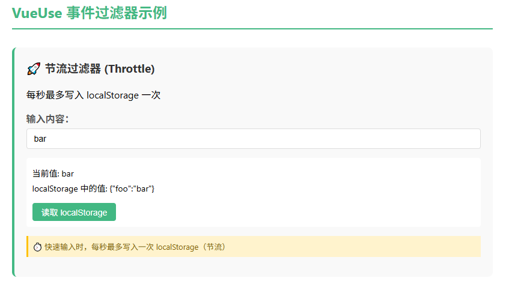
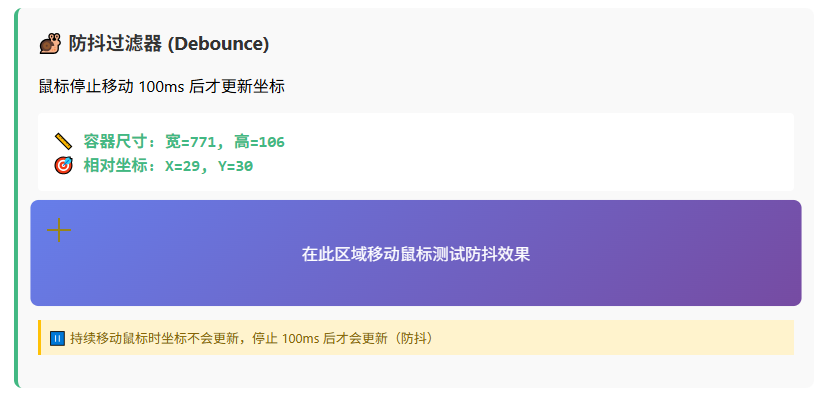
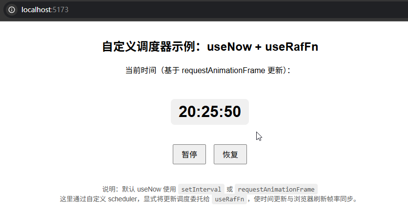

# P4S29L83：Vue 第三方库 VueUse 的用法简介

---


## 1 概述

`VueUse` 是一个基于 `Vue` 组合式 `API` 的工具库，里面提供了一系列高效、易用的组合函数，用于简化 `Vue` 开发，节省开发时间。

`VueUse` 官网：https://vueuse.org/

`VueUse` 主要特点：

1. 丰富的组合函数
2. `TS` 支持
3. 轻量级
4. 良好的文档

`VueUse` 有很多 [分类](https://vueuse.org/functions.html)，每个分类下面又有各种丰富的 `API`：

1. 浏览器 `API`

   - `useFetch`：用于发起 `HTTP` 请求，类似于浏览器的 `fetch API`。

   - `useClipboard`：用于操作剪贴板，例如复制文本。

   - `useLocalStorage`：简化 `localStorage` 的使用。

     …

2. 状态管理

   - `useToggle`：一个简单的开关状态管理工具。

   - `useCounter`：用于计数的状态管理工具。

     …

3. 传感器

   - `useMouse`：追踪鼠标的位置和状态。
   - `useGeolocation`：获取地理位置信息。

4. 用户界面

   - `useFullscreen`：控制元素的全屏状态。
   - `useDark`：检测和切换暗模式。

5. 工具函数

   - `useDebounce`：提供防抖功能。
   - `useThrottle`：提供节流功能。


## 2 基础用法示例

安装 `VueUse`：

```bash
npm install @vueuse/core
```

然后在项目中引入并使用：

```vue
<template>
  <div>{{ x }}</div>
  <div>{{ y }}</div>
</template>

<script setup>
import { useMouse } from '@vueuse/core'

const { x, y } = useMouse()
</script>

<style scoped></style>
```

实测效果：


## 3 综合示例：待办事项

要求：使用 `VueUse` 里的两个工具方法：`useLocalStorage`、`useToggle`。

最终效果：


## 4 实测备忘

课件中的示例代码有问题：刷新待办事项页面后，无法通过切换复选框实现待办事项当前状态的同步切换：

```bash
Uncaught TypeError: props.task.toggleCompleted is not a function
```

控制台报错情况：


原因：`localStorage` 无法持久化函数：

```js
// before
const addTask = () => {
  // 完成这部分代码，使用 useToggle 来切换任务的状态
  if (newTask.value.trim() === '') return
  // isCompleted 是初始状态
  // toggleCompleted 是切换状态的方法
  // 后面传递的 false 是初始状态
  const [isCompleted, toggleCompleted] = useToggle(false)
  tasks.value.push({
    id: Date.now(),
    text: newTask.value,
    completed: isCompleted,
    toggleCompleted  // Bug: localStorage 无法持久化函数
  })
  newTask.value = ''
}

// after
const addTask = () => {
  if (newTask.value.trim() === '') return
  // 后面传递的 false 是初始状态
  tasks.value.push({
    id: Date.now(),
    text: newTask.value,
    completed: false
  })
  newTask.value = ''
}

const onToggle = (task) => {
  // 完成这部分代码，使用 useToggle 来切换任务的状态
  // isCompleted 是初始状态
  // toggleCompleted 是切换状态的方法
  const [isCompleted, toggleCompleted] = useToggle(task.completed)
  toggleCompleted()
  task.completed = isCompleted.value
}
```

修复后可以正常刷新：


## 5 DIY 扩展

### 5.1 实测 VueUse 的 Event Filter 事件筛选条件机制

实测示例中的 `useLocalStorage` 是实时写入本地 `localStorage` 的，根据 [官方文档](https://vueuse.org/guide/config.html) 的介绍，该组合式函数还支持 `Event Filters` 事件筛选条件机制，可以设置节流和防抖（`v4.0+`）：

```js
import { debounceFilter, throttleFilter, useLocalStorage, useMouse } from '@vueuse/core'

// changes will write to localStorage with a throttled 1s
const storage = useLocalStorage('my-key', { foo: 'bar' }, { eventFilter: throttleFilter(1000) })

// mouse position will be updated after mouse idle for 100ms
const { x, y } = useMouse({ eventFilter: debounceFilter(100) })
```

`DeepSeek` 补全后的示例效果（详见 `L83_vueuse` 分支 `f03ff59`）：

节流示例：`throttleFilter` + `useLocalStorage`



防抖示例：`debounceFilter` + `useMouse`




### 5.2 实测 VueUse 定时任务的定制

From v14.1.0, VueUse introduces a custom scheduler system that allows you to control how time-based functions update internally. For example, to align with [`useRafFn`](https://vueuse.org/core/useRafFn/), slow down updates, or run inside a Web Worker.
从 `v14.1.0` 开始，`VueUse` 引入了一个自定义调度器系统，用于控制基于时间的函数在内部的更新方式。例如，可以与 `useRafFn` 同步、减缓更新速度，或在 `Web Worker` 中运行。

When a composable supports timing (such as [`useNow`](https://vueuse.org/core/useNow/), [`useCountdown`](https://vueuse.org/core/useCountdown/), etc.), you can pass a `scheduler` function in its options. The `scheduler` receives a callback and is responsible for scheduling its repeated execution.
当某个组合式函数（`composable`）支持定时功能（例如 `useNow` 、 `useCountdown` 等）时，可以在其配置项中传入一个 `scheduler` 函数。该 `scheduler` 函数会接收一个回调函数，并负责调度其重复执行。

`DeepSeek`：以下是一个完整的 `App.vue` 示例，演示了 VueUse 的**自定义调度器（Custom Scheduler）** 功能，利用 `useRafFn` 让 `useNow` 基于 `requestAnimationFrame` 更新，并支持暂停/恢复（完整代码详见 `6a60a5a`）：



核心代码：让时间的更新与浏览器的刷新帧率同步（基于 `requestAnimationFrame`）：

```js
import { useNow, useRafFn } from '@vueuse/core'

// 使用自定义调度器，让 useNow 的更新由 requestAnimationFrame 驱动
const { now, pause, resume } = useNow({
  controls: true,                    // 返回 pause / resume 方法
  scheduler: (cb) => useRafFn(cb),   // 调度器：接收回调 cb，返回一个可控制启动/停止的对象
})
```

