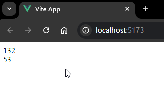
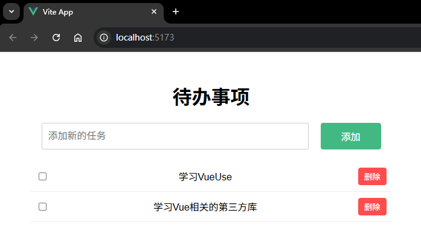
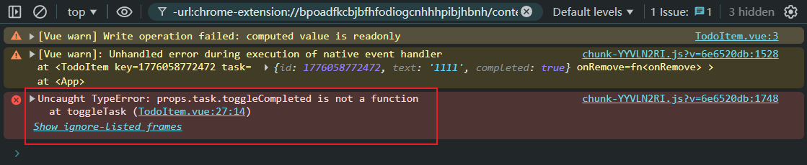
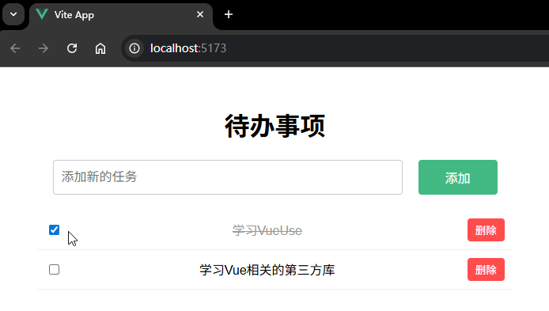

# P4S29L83：Vue 第三方库 VueUse 的用法简介

---


## 1 概述

`VueUse` 是一个基于 `Vue` 组合式 `API` 的工具库，里面提供了一系列高效、易用的组合函数，用于简化 `Vue` 开发，节省开发时间。

`VueUse` 官网：https://vueuse.org/

`VueUse` 主要特点：

1. 丰富的组合函数
2. `TS` 支持
3. 轻量级
4. 良好的文档

`VueUse` 有很多 [分类](https://vueuse.org/functions.html)，每个分类下面又有各种丰富的 `API`：

1. 浏览器 `API`

   - `useFetch`：用于发起 `HTTP` 请求，类似于浏览器的 `fetch API`。

   - `useClipboard`：用于操作剪贴板，例如复制文本。

   - `useLocalStorage`：简化 `localStorage` 的使用。

     …

2. 状态管理

   - `useToggle`：一个简单的开关状态管理工具。

   - `useCounter`：用于计数的状态管理工具。

     …

3. 传感器

   - `useMouse`：追踪鼠标的位置和状态。
   - `useGeolocation`：获取地理位置信息。

4. 用户界面

   - `useFullscreen`：控制元素的全屏状态。
   - `useDark`：检测和切换暗模式。

5. 工具函数

   - `useDebounce`：提供防抖功能。
   - `useThrottle`：提供节流功能。


## 2 基础用法示例

安装 `VueUse`：

```bash
npm install @vueuse/core
```

然后在项目中引入并使用：

```vue
<template>
  <div>{{ x }}</div>
  <div>{{ y }}</div>
</template>

<script setup>
import { useMouse } from '@vueuse/core'

const { x, y } = useMouse()
</script>

<style scoped></style>
```

实测效果：




## 3 综合示例：待办事项

要求：使用 `VueUse` 里的两个工具方法：`useLocalStorage`、`useToggle`。

最终效果：




## 4 实测备忘

课件中的示例代码有问题：刷新待办事项页面后，无法通过切换复选框实现待办事项当前状态的同步切换：

```bash
Uncaught TypeError: props.task.toggleCompleted is not a function
```

控制台报错情况：



原因：`localStorage` 无法持久化函数：

```js
// before
const addTask = () => {
  // 完成这部分代码，使用 useToggle 来切换任务的状态
  if (newTask.value.trim() === '') return
  // isCompleted 是初始状态
  // toggleCompleted 是切换状态的方法
  // 后面传递的 false 是初始状态
  const [isCompleted, toggleCompleted] = useToggle(false)
  tasks.value.push({
    id: Date.now(),
    text: newTask.value,
    completed: isCompleted,
    toggleCompleted  // Bug: localStorage 无法持久化函数
  })
  newTask.value = ''
}

// after
const addTask = () => {
  if (newTask.value.trim() === '') return
  // 后面传递的 false 是初始状态
  tasks.value.push({
    id: Date.now(),
    text: newTask.value,
    completed: false
  })
  newTask.value = ''
}

const onToggle = (task) => {
  // 完成这部分代码，使用 useToggle 来切换任务的状态
  // isCompleted 是初始状态
  // toggleCompleted 是切换状态的方法
  const [isCompleted, toggleCompleted] = useToggle(task.completed)
  toggleCompleted()
  task.completed = isCompleted.value
}
```

修复后可以正常刷新：



