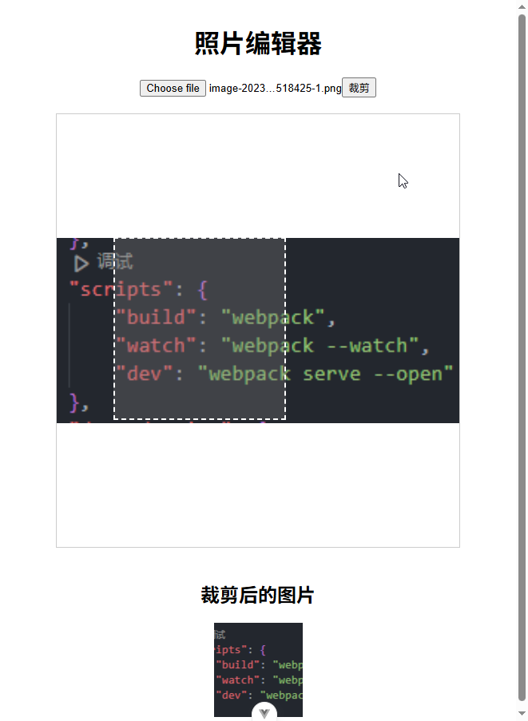

# P4S31L85：Vue 第三方库 vue-drag-resize 实战

---


`vue-drag-resize`：与拖拽相关的第三方库，可调整元素位置和尺寸大小。

- `vuedraggable`：主要用于列表项的拖拽排序。
- `vue-drag-resize`：主要用于需要用户交互调整大小和位置的元素，如看板、图表、可视化编辑器等。


## 1 基本用法

安装工具库：

```bash
npm install vue-drag-resize
```

本例安装版本：`"vue-drag-resize": "^1.5.4"`

接下来从 `vue-drag-resize/src` 中可以导入一个组件 **VueDragResize**，该组件提供一个默认插槽，可以存放要 `resize` 的模板内容。

基本示例核心代码：

```vue
<template>
  <div id="app">
    <VueDragResize
      :w="200"
      :h="150"
      :x="100"
      :y="100"
      :min-width="50"
      :min-height="50"
      @resizing="resizeHandle"
      @dragging="() => console.log('拖拽中')"
    >
      <div class="content">可拖拽和调整大小的元素</div>
    </VueDragResize>
  </div>
</template>

<script setup>
// 注意，这里是从 vue-drag-resize下面的 src 目录导出的组件
import VueDragResize from 'vue-drag-resize/src'

const resizeHandle = (size) => {
  console.log('调整了元素大小')
  console.log(size)
}
</script>
```


## 2 场景示例

用户选择图片，然后可以自由的对图片进行裁剪。

总思路：先用 `FileReader` 加载上传的图片，然后用 `vue-drag-resize` 控制蒙版元素的拖动与缩放，最后利用 `canvas` 绘制蒙版内的图像，将其导出为图片 `Base64` 格式后回显到下方预览区。

实测效果：

