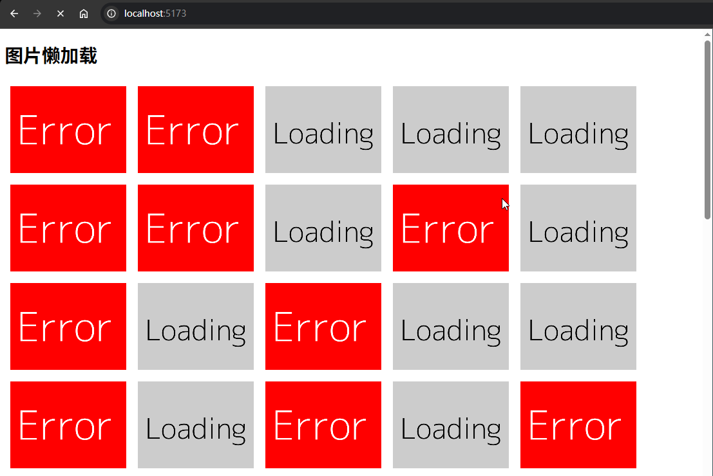
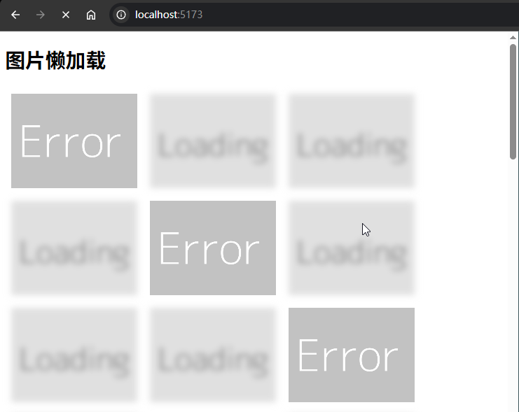
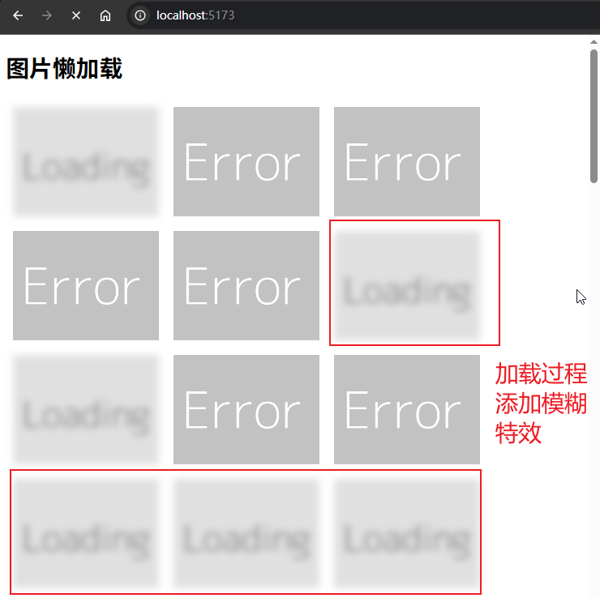

# P4S34L88：Vue 第三方库 vue3-lazyload 实战

---


## 1 概述

`vue3-lazyload` 是一个用于 `Vue3` 应用的 **图片懒加载库**，可在图片进入视口之前不加载图片，从而提升页面的加载速度和性能。

`vue3-lazyload` 主要特点有：

1. 轻量级
2. 简单易用
3. 支持占位图（默认图片）
4. 支持自定义加载和错误处理


## 2 图片懒加载的基本原理

在页面首次加载的时候，只有视口里面的图片才会被加载，其他图片需要用户滚动到视口时才会加载（`src` 与 `data-src` 的切换）。

> [!tip]
>
> `vue3-lazyload` 常见问题 `FAQ`
>
> **思考1：学了虚拟列表，长列表都可以用虚拟列表来处理，懒加载是不是已经被淘汰了？**
>
> 1. 懒加载
>    - 适用场景：图片较多但数量不至于太多的列表，通常是 **几十到几百项**。
>    - 工作原理：延迟加载进入视口的图片或资源，在用户滚动到接近这些资源时再进行加载。
>    - 优点：减小初始页面加载时间，减少带宽消耗。
>    - 缺点：在数量非常多时（如数万或十万项），`DOM` 节点的数量会变得非常庞大，导致浏览器渲染性能下降。
>
> 2. 虚拟列表
>    - 适用场景：非常长的列表，通常是 **数千到数十万项**。
>    - 工作原理：只渲染视口内的部分 `DOM` 节点，并动态复用这些 `DOM` 节点来展示不同的数据项。
>    - 优点：极大地减少了 `DOM` 节点的数量，提高渲染性能和内存使用效率。
>    - 缺点：实现较为复杂，尤其是需要处理动态高度项和滚动同步的问题。
>
> **思考2：之前用 vue3-observe-visibility 实现过懒加载，vue3-lazyload 较之 vue3-observe-visibility 有哪些优势？**
>
> - `vue3-observe-visibility`：侧重于元素是否进入指定的根元素，至于进入/离开指定根元素后要做什么完全由用户自主决定；
> - `vue3-lazyload`：专为 **图片懒加载** 而生的。
>


## 3 基本用法

首先安装这个库：

```bash
npm i vue3-lazyload
```

然后在入口文件入并配置 `vue3-lazyload`：

```js
import { createApp } from 'vue';
import App from './App.vue';
// 引入这个库
import VueLazyload from 'vue3-lazyload';

const app = createApp(App);

// 注册这个库
app.use(VueLazyload, {
  loading: 'https://dummyimage.com/600x400/cccccc/000000&text=Loading', // 图片加载时显示的占位图片
  error: 'https://dummyimage.com/600x400/ff0000/ffffff&text=Error', // 图片加载失败时显示的图片
  // 和IntersectionObserver相关的配置选项
  observerOptions: {
    rootMargin: '0px',
    threshold: 0.1,
  },
  log: true, // 是否打印调试信息
  logLevel: 'error', // 日志级别
  delay: 0, // 设置延迟加载的时间
});

app.mount('#app');
```

配置选项说明如下：

- `loading`：图片加载时显示的占位图片
- `error`：图片加载失败时显示的图片
- `observerOptions`：`IntersectionObserver` 的配置选项
- `log`：是否打印调试信息
- `logLevel`：日志级别
- `delay`：设置延迟加载时间

之后在组件中使用 `v-lazy` 指令：

```vue
<template>
	<!-- 使用v-lazy这个指令，指令对应的值为图片的src -->
  
</template>
```

指令对应的值也可以是一个对象，在对象中可以指定 `loading` 和 `error` 图片：

```vue
<template>
  
</template>
```

### 快速上手示例

实测截图：




## 4 用法细节

### 4.1 生命周期

该库支持三个钩子方法：`loading`、`error` 以及 `loaded`：

```js
app.use(VueLazyLoad, {
  loading: '',
  error: '',
  lifecycle: {
    loading: (el) => {
      console.log('loading', el)
    },
    error: (el) => {
      console.log('error', el)
    },
    loaded: (el) => {
      console.log('loaded', el)
    }
  }
})
```


### 4.2 observerOptions 配置

`observerOptions` 用于配置 `IntersectionObserver`，可精确控制懒加载的触发时机与行为。该配置项的值是一个 `JS` 对象：

- `rootMargin`
  - 类型：`string`
  - 默认值：`'0px'`
  - 作用：用于扩展或缩小根元素的边界。类似于 `CSS` 的 `margin` 属性，可以设置四个方向的值，如 `10px 20px 30px 40px`。该属性可以让你提前或延后触发懒加载。例如，设置为 `'100px'`，表示在元素距离视口 `100px` 时就触发加载。
- `threshold`
  - 类型：`number`
  - 默认值：`0.1`
  - 作用：用于指定一个或多个 **阈值**，当目标元素的可见比例达到这些阈值时触发回调。阈值可以是从 `0` 到 `1` 之间的数值，`0` 表示元素刚出现时就触发，`1` 表示元素完全可见时才触发。


### 4.3 注册方式

前面注册方式为 **全局注册**，另一种是 **局部注册**，通过 **useLazyload** 在单个组件中注册，从而局部使用懒加载功能。

```vue
<template>
  
</template>

<script setup>
import { computed } from 'vue'
import { useLazyload } from 'vue3-lazyload'
import error from '@/assets/error.png'
import loading from '@/assets/loading.png'

const props = defineProps({
  src: {
    type: String,
    required: true
  }
})

const src = computed(() => props.src)

// 在该组件中，通过 useLazyload 来创建懒加载链接
// 注意：参数第一项是图片真实的 src
const lazyRef = useLazyload(src, {
  lifecycle: {
    loading: () => {
      console.log('loading')
    },
    error: () => {
      console.log('error')
    },
    loaded: () => {
      console.log('loaded')
    }
  },
  loading, // 图片加载时显示的占位图片
  error // 图片加载失败时显示的图片
})
</script>

<style scoped>
.image {
  display: block;
  margin: 10px;
  width: 200px;
  height: 150px;
  object-fit: cover;
}
</style>
```

局部注册实测效果（完整源码详见 `code/diy`）：




### 4.4 控制加载样式

可以精确的控制图片不同加载状态的样式，`vue3-lazyload` 提供了 3 个状态：

- `loading`：图片正在加载中
- `loaded`：图片加载完成
- `error`：图片加载失败

在图片元素上，这些状态会通过 `lazy` 属性（`attribute`）来表示。可以利用这个属性，在 `CSS` 中定义不同状态下图片的样式：

```vue


<style>
  img[lazy=loading] {
    /*your style here*/
  }
  img[lazy=error] {
    /*your style here*/
  }
  img[lazy=loaded] {
    /*your style here*/
  }
</style>
```

实测效果：




## 5 实测备忘

:one: 示例代码的图片地址已作废，最好改用 `dummyimage` 图片，类似结构：

```bash
# https://dummyimage.com/{w}x{h}/{background_color_hex}/[text_color_hex]&text={content}
https://dummyimage.com/600x400/cccccc/000000&text=Loading
```

该 `API` 也是 `Mock.js`（[http://mockjs.com/](http://mockjs.com/)）生成随机图片时底层调用的图片 `API`。具体用法详见官方文档：[https://dummyimage.com/](https://dummyimage.com/)。

:two: 根据 `P4S06L60` 课笔记，`Vue` 中的自定义插件是通过创建一个 `install` 方法实现的。因此这里的全局注册形式：

```js
const app = createApp(App)
app.use(VueLazyload, {
  loading: 'xxx',
  error: 'xxx'
})
```

本质上是通过自定义插件的形式为 `Vue` 新增了一个自定义指令 `v-lazy` 以及其他配套属性，例如绑定 `DOM` 元素上的 `lazy` 属性（`attribute`）。

