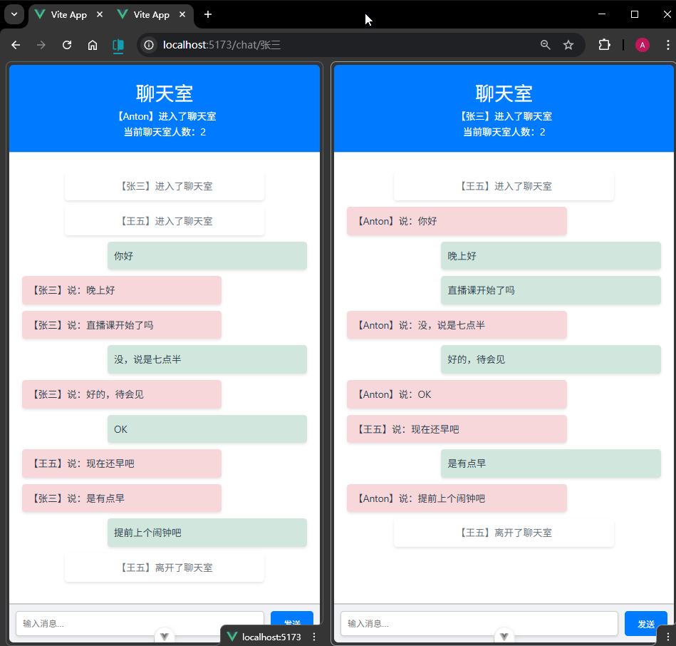

# P4S35L89：Vue 应用场景之 Websocket 聊天室

---


## 1 Socket.IO

`Socket.IO` 是一个用于实现 **实时双向通信** 的库，通常用于构建需要实时交互的 `Web` 应用程序。它 **建立在 WebSocket 协议之上**，但比 `WebSocket` 提供了更高级的功能和更好的兼容性。

### 主要特性

1. 实时双向通信：支持客户端和服务器之间的实时消息交换。
2. 自动重连：连接断开后，`Socket.IO` 会自动尝试重新连接。
3. 事件驱动架构：使用事件的方式处理通信，支持自定义事件，使得开发更加直观和灵活。
4. 跨平台兼容性：即使在不支持 `WebSocket` 的环境中，`Socket.IO` 也能通过轮询等其他技术进行通信。
5. 命名空间（`Namespaces`）：允许通过命名空间将不同的通信逻辑隔离开来，便于管理和扩展。
6. 房间（`Rooms`）：可以将客户端分配到特定的房间，便于进行组播、广播等操作。

### 适用场景

- 即时通讯应用：如聊天软件、客服系统。
- 协同编辑：实时同步文档或表格的编辑状态。
- 多人在线游戏：同步游戏状态和玩家动作。
- 实时数据更新：如股票、天气等实时信息推送。
- 实时通知和警报系统。


## 2 示例技术栈

服务端：`Node.js + Express`

客户端：`Vue3 + Vite`


## 3 聊天室实战

客户端需要安装 `sokcet.io-client` 这个库，安装完成后需要在 `main.js` 注册：

```js
// main.js

// 创建一个 socket 客户端实例
const socket = io('http://localhost:3000', {
  // 这里是在配置客户端与服务器端建立连接的优先级列表
  // 1. 第一优先级使用 websocket
  // 2. 第二优先级使用 polling（长轮询）
  // 3. 第三优先级使用 flashsocket
  transports: ['websocket', 'polling', 'flashsocket']
})

// 将 socket 实例挂载到 app.config.globalProperties 上
app.config.globalProperties.$socket = socket
```

全局属性在组件中的用法：

```js
// ./src/views/Chat.vue:
import { getCurrentInstance } from 'vue'
const { proxy } = getCurrentInstance()
const socket = proxy.$socket
```

实测截图：




## 4 实测备忘

:one: 和之前所有的示例项目不同，本节案例需要在 `node` 后端编写业务逻辑，处理来自客户端的各种 `Websocket` 事件，并根据情况推送不同的数据给客户端。

:two: `Websocket` 相关知识在袁老师主讲的 `Node` 课程第五章前三节有详细讲解（第三节也是实现一个在线聊天室的案例）。

:three: 本节用到的高频 `API` 接口梳理如下：

- `socket.emit(event_name, data)`：根据事件名发送数据；
- `socket.on(event_name, callback)`：侦听一个事件名，侦听成功后触发 `callback` 中的回调逻辑。
