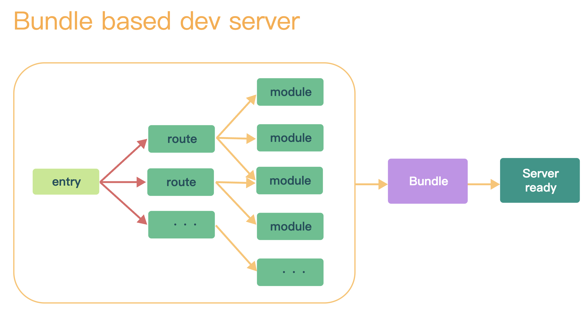
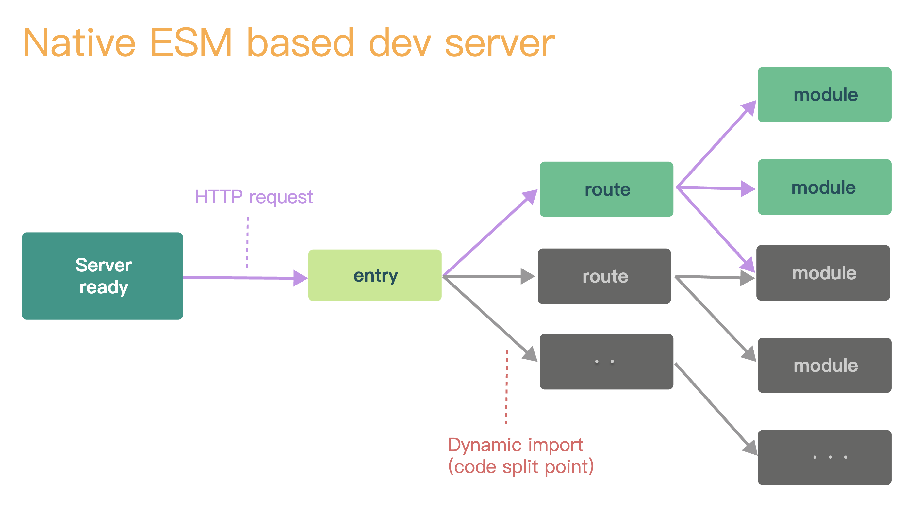
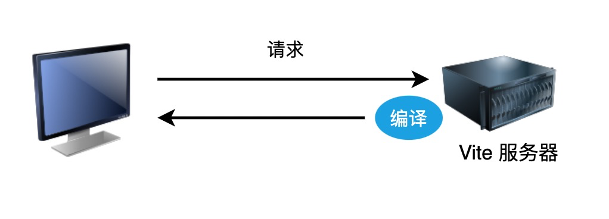

# P4S36L90：认识 Vite

---

## 1 什么是 Vite

是脚手架？是构建工具？

首先搞清楚这两者的定义：

1. 脚手架：帮助我们搭建开发环境项目代码的工具
2. 构建工具：将代码从开发环境构建到生产环境

构建工具的发展：

1. 第一代构建工具：以 `npm scripts`、`grunt`、`gulp` 为代表的构建工具，这一代构建工具所做的事情主要就是编译、合并以及压缩等工作。
2. 第二代构建工具：以 `browserify`、`webpack`、`parcel`、`rollup` 为代表的构建工具。这一代构建工具加强了对模块的处理，能够对模块的依赖关系进行处理，对模块进行合并打包。
3. 第三代构建工具：主要就是往【锈化】的方向发展，即使用 `Rust` 将前端工具链全部重构一遍——
   - `Babel` ---> `swc`
   - `PostCSS` ---> `lightingCSS`
   - `Electron` ---> `Tauri`
   - `ESLint` ----> `dprint`
   - `Webpack` ---> `Turbopack`、`Rspack`
   - `rollup` ---> `rolldown`

脚手架的发展：本身是帮助开发者搭建开发环境项目的工具，但是现代脚手架往往内置构建工具

- `VueCLI`：内置了 `Webpack` 作为构建工具
- `CreateReactApp`：内置了 `Webpack` 作为构建工具

现在脚手架和构建工具的界限比较模糊了，你可以认为构建工具是脚手架工具里面的一部分。

`Vite` 也是相同的情况：

1. 脚手架：可以搭建各种类型（`Vue`、`React`、`Svelte`、`Solid.js`）的项目
2. 构建：包含两个构建工具
   - `esbuild`：用于开发环境
   - `rollup`：用于生产环境

## 2 Vite 核心原理

### 2.1 Webpack 的痛点

- 大型项目的构建速度非常慢；

- `Webpack` 启动时会先对项目进行打包，然后运行打包后的文件；

  

### 2.2 Vite 提供的解决方案

- 完全跳过打包的步骤，利用浏览器的 `imports` 机制，按需获取内容：

  

- 浏览器针对 `.vue` 型模块文件进行编译处理，编译为 `JS` 文件后再响应给浏览器：

  

- `Vite` 中热更新，其底层用的是 `Websocket` 实现。

